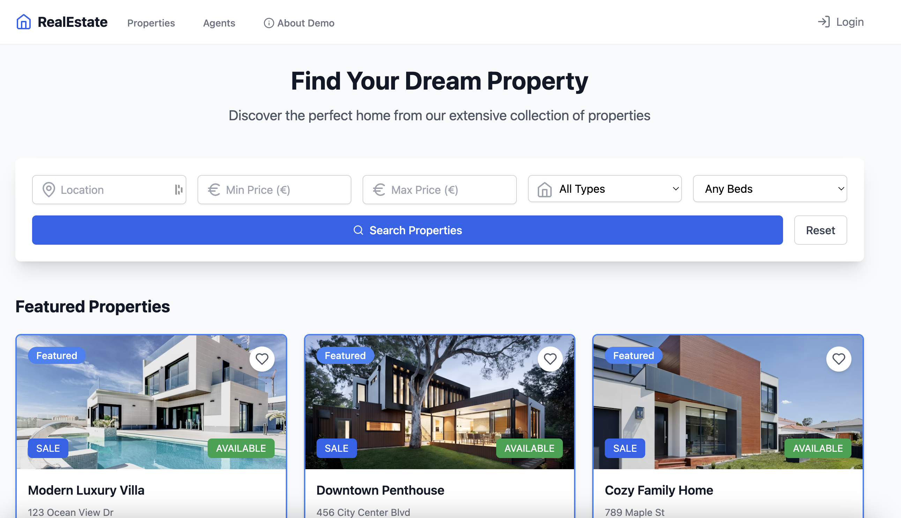

# Real Estate Platform Demo

A real estate platform built with React, TypeScript, and modern web technologies. This project serves as a demonstration of full-stack development capabilities for test automation practices.



## 🚀 Getting Started

### Prerequisites
- Node.js 18 or higher
- npm or yarn

### Installation

1. Clone the repository
```bash
git clone https://github.com/Aviv-public/aviv-qa-technical-test.git
cd aviv-qa-technical-test

```

2. Install dependencies
```bash
npm install
```

3. Start the development server
```bash
npm run dev
```

## 🧪 Submitting Tests

QA Engineers, responsible for ensuring the quality and functionality of the API, should follow test automation best practices including:

#### Page Object Pattern
- Implement Page Object Model (POM) to create an object repository for web UI elements
- Each page should have its corresponding page class
- Maintain separation between test methods and page specific code
- Group related elements and actions within relevant page objects

#### Data-Driven Testing
- Externalize test data in JSON/YAML files
- Parameterize tests to run with multiple data sets
- Maintain test data separate from test logic
- Include both positive and negative test scenarios

#### Test scenarios that need to be implemented
- Implement test cases for user registration, login, and logout
- Test user roles and permissions (Admin, Agent, User)
- Verify user profile management functionality
- Test property listing and search functionality
- Validate property details and booking process
- Verify user notifications and alerts


#### Coverage Requirements
- Minimum 80% test coverage for critical paths
- Test all user roles (Admin, Agent, User)

#### Technical Stack
- Test Automation Frameworks:
    - Choose one of the following:
        - Selenium WebDriver (Java/Python/JavaScript)
        - WebDriver.IO (JavaScript/TypeScript)
        - Cypress (JavaScript/TypeScript)
        - Playwright (JavaScript/TypeScript)
- Continuous Integration:
    - GitHub Actions for automated test execution
    - Parallel test execution
    - Scheduled test runs
- Test Reporting:
    - Allure Reports integration
    - Detailed test execution results
    - Screenshots and video captures

### Contribution Steps
1. **Fork the repository:**
    Go to the repository on GitHub and click the "Fork" button to create a copy of the repository in your own GitHub account.

2. **Clone your forked repository:**
    ```bash
    git clone https://github.com/username/aviv-qa-technical-test.git
    cd aviv-qa-technical-test
    ```

3. **Create a new branch:**
    ```bash
    git checkout -b test-branch-name
    ```

4. **Add your test cases:**
    Add your test cases in the `tests` directory.

5. **Commit your changes:**
    ```bash
    git add .
    git commit -m "Add test cases"
    ```

6. **Create a GitHub Actions workflow:**
    In the root of your repository, create a directory named `.github/workflows` if it doesn't already exist. Inside this directory, create a file named `ci.yml`.

7. **Push your branch:**
    ```bash
    git push origin test-branch-name
    ```

8. **Create a pull request:**
    Go to the repository on GitHub and create a pull request to merge your test branch into the main branch.

## 📄 License

This project is MIT licensed.
